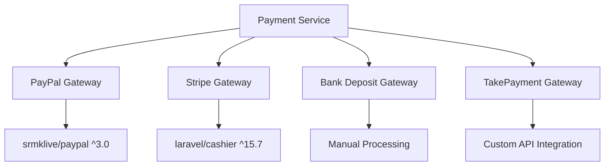
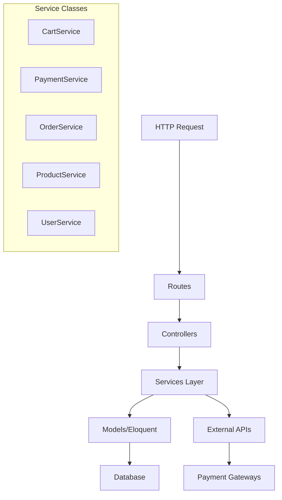
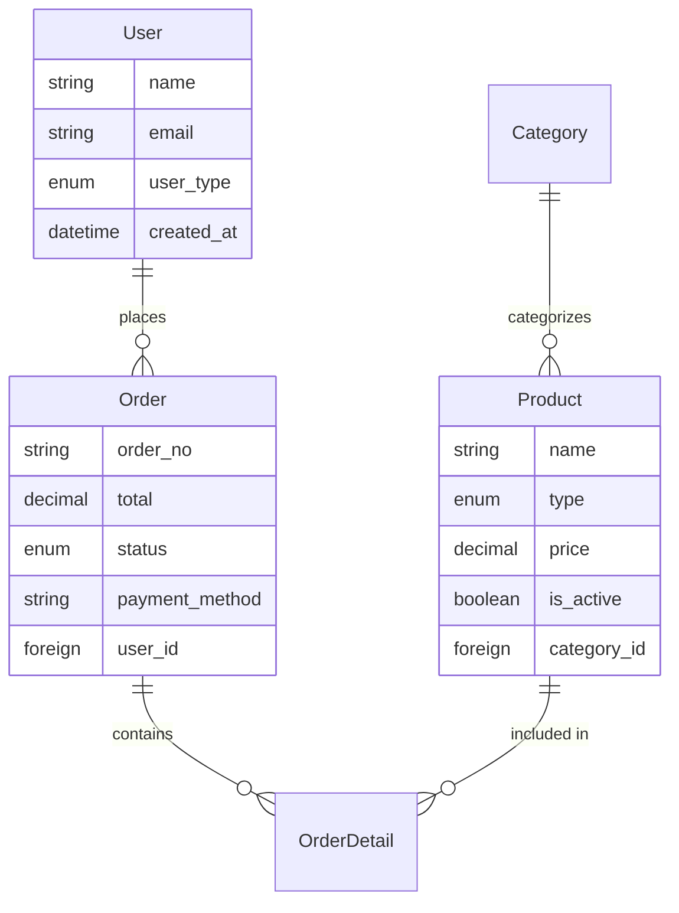
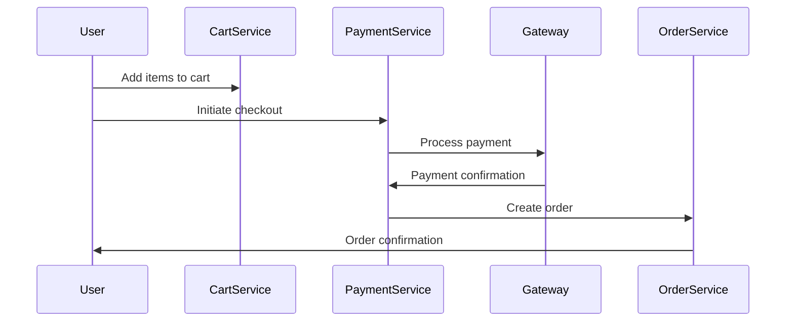
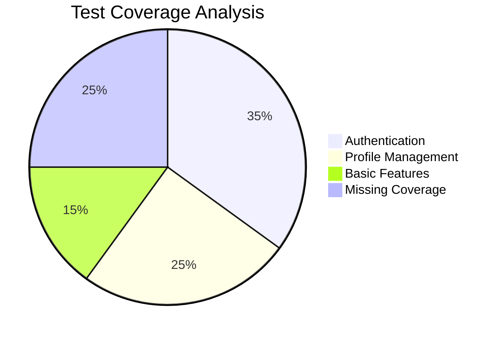
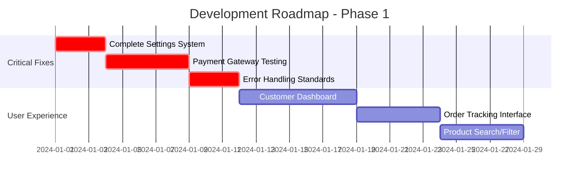
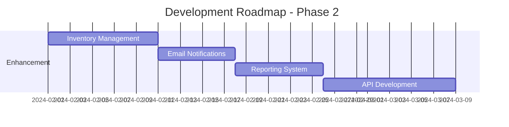
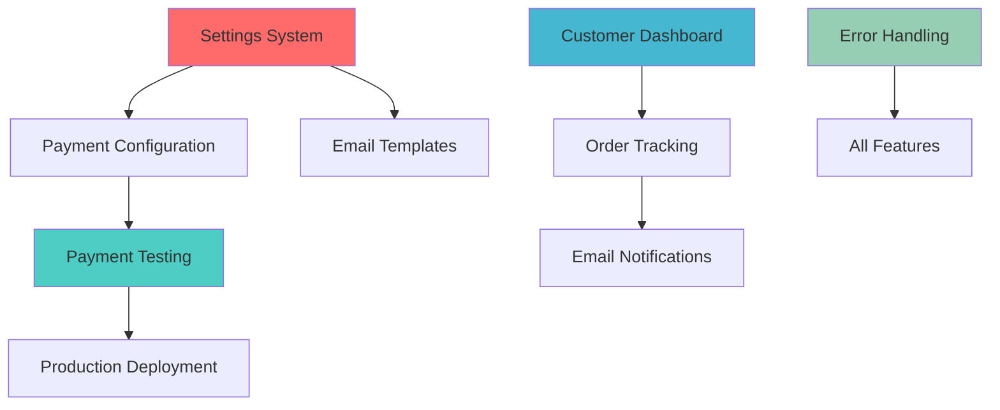
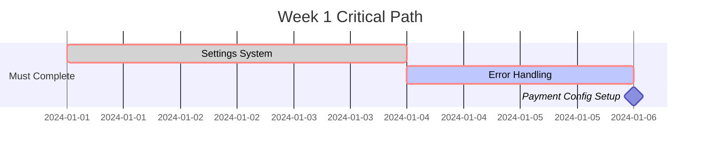

# Sejis Laravel E-Commerce Project Analysis

## Overview

**Project Type**: Laravel-based E-Commerce Platform  
**Framework**: Laravel 12  
**Primary Domain**: Kitchen Rental & Product Management System  
**Architecture**: MVC with Service Layer Pattern  
**Development Status**: Mid-stage development with core functionality implemented  

The Sejis project is a comprehensive e-commerce platform focused on kitchen rental services and product sales, featuring multi-payment gateway integration, role-based access control, and comprehensive order management capabilities.

## Technology Stack & Dependencies

### Backend Framework
- **Laravel 12** - Latest framework version with modern PHP 8.2+ features
- **PHP 8.2+** - Modern PHP with enhanced performance and type safety
- **Eloquent ORM** - Database abstraction and relationships

### Frontend & Assets
- **Vite 6.2.4** - Modern build tool for asset compilation
- **Tailwind CSS 3.1.0+** - Utility-first CSS framework
- **Alpine.js** - Lightweight JavaScript framework for interactivity
- **Blade Templates** - Server-side rendering

### Payment Integration


### Key Dependencies
- **spatie/laravel-medialibrary ^11.13** - Media management
- **anayarojo/shoppingcart ^4.2** - Shopping cart functionality
- **pestphp/pest ^3.8** - Modern testing framework

## Architecture

### Service Layer Architecture


### Component Hierarchy

#### Models & Relationships


#### Controller Organization
- **Admin Controllers**: Product, Order, Category, User management
- **Frontend Controllers**: Home, Cart, Checkout, Kitchen Rental
- **Auth Controllers**: Registration, Login, Password management

## Data Models & ORM Mapping

### Core Entities

#### User Model
```php
// Enums: UserTypeEnum (SUPER_ADMIN, ADMIN, CUSTOMER)
// Authentication: Laravel Breeze integration
// Role Management: AdminMiddleware for access control
```

#### Product Model
```php
// Features: Spatie Media Library integration
// Types: ProductTypeEnum with kitchen rental support
// Pricing: Supports both fixed and per-day pricing
// Categories: Hierarchical category relationships
```

#### Order Management
```php
// Status Flow: PENDING → PAID → COMPLETED (or CANCELED)
// Payment Integration: Multi-gateway support
// Details: Booking dates, durations, quantities
```

### Business Logic Layer

#### Payment Processing Flow


#### Order Lifecycle
- **Creation**: Cart items converted to order details
- **Payment**: Multi-gateway processing with callbacks
- **Fulfillment**: Status tracking and updates
- **Completion**: Final status and notifications

## Testing Strategy

### Current Test Coverage


#### Existing Tests (PestPHP)
- **Authentication Flow**: Login, registration, password reset
- **Profile Management**: Updates, email verification
- **Basic Integration**: Homepage rendering

#### Missing Test Areas
- **Payment Processing**: Gateway integrations untested
- **Cart Operations**: Add, update, remove functionality
- **Order Management**: Lifecycle and status changes
- **Admin Features**: Product/category management
- **Kitchen Rental**: Booking and scheduling logic

## Current Implementation Status

### ✅ Completed Features
- User authentication and role management
- Product and category CRUD operations
- Shopping cart functionality
- Multi-payment gateway integration
- Order creation and tracking
- Admin dashboard structure
- Opening hours and holiday scheduling
- Media file management

### ⚠️ Partially Implemented
- **Settings System**: Controller exists but empty implementation
- **Admin Features**: Some controllers lack full CRUD operations
- **Frontend UI**: Limited customer-facing pages
- **Payment Callbacks**: Some gateways need completion
- **Error Handling**: Inconsistent across controllers

### ❌ Missing Features
- **Inventory Management**: Stock tracking and alerts
- **Customer Dashboard**: Order history, profile management
- **Email Notifications**: Order confirmations, status updates
- **Reporting System**: Sales analytics and reporting
- **API Layer**: RESTful API for mobile/external integration
- **Advanced Search**: Product filtering and search functionality

## Critical Development Gaps

### 1. Incomplete Settings Management
```php
// Current: Empty controller methods
class SettingController extends Controller
{
    public function index() { // Empty implementation }
}

// Needed: Configuration management for:
// - Site settings, payment configurations
// - Email templates, notification preferences
// - Business rules and validation settings
```

### 2. Limited Frontend User Experience
- Missing customer dashboard
- No order tracking interface
- Limited product browsing capabilities
- Missing search and filtering

### 3. Testing Infrastructure Deficits
- No payment gateway testing
- Missing service layer tests
- No admin functionality testing
- Limited integration test coverage

## Next Development Actions

### Phase 1: Core System Completion (High Priority)


#### 1.1 Settings System Implementation
**Priority**: Critical  
**Effort**: 3-5 days  

```php
// Implement comprehensive settings management
// - Site configuration (name, logo, contact info)
// - Payment gateway configurations
// - Email templates and SMTP settings
// - Business rules (tax rates, shipping)
// - Notification preferences
```

#### 1.2 Payment System Hardening
**Priority**: Critical  
**Effort**: 5-7 days  

- Complete TakePayments gateway implementation
- Add comprehensive payment testing
- Implement webhook security validation
- Add payment failure recovery mechanisms
- Create payment audit logging

#### 1.3 Customer-Facing Features
**Priority**: High  
**Effort**: 7-10 days  

- Complete customer dashboard with order history
- Implement order tracking and status updates
- Add product search and filtering capabilities
- Create responsive product catalog interface

### Phase 2: System Enhancement (Medium Priority)


#### 2.1 Inventory Management System
- Stock level tracking and alerts
- Automatic inventory updates on orders
- Low stock notifications
- Supplier management integration

#### 2.2 Communication System
- Order confirmation emails
- Status update notifications
- Admin alert system
- Customer support integration

#### 2.3 Business Intelligence
- Sales reporting and analytics
- Customer behavior tracking
- Revenue analysis dashboards
- Export capabilities

### Phase 3: Advanced Features (Lower Priority)

#### 3.1 API Layer Development
- RESTful API for mobile applications
- Third-party integration capabilities
- API documentation and testing
- Rate limiting and security

#### 3.2 Performance Optimization
- Database query optimization
- Caching implementation (Redis/Memcached)
- CDN integration for media files
- Load testing and performance monitoring

#### 3.3 Security Enhancement
- Two-factor authentication
- Advanced role permissions
- Security audit logging
- GDPR compliance features

## Feature Prioritization Matrix

### Priority Assessment Framework

```mermaid
quadrant-chart
    title Feature Priority Matrix
    x-axis Low Impact --> High Impact
    y-axis Low Effort --> High Effort
    
    quadrant-1 Quick Wins
    quadrant-2 Major Projects
    quadrant-3 Fill-ins
    quadrant-4 Strategic Initiatives
    
    Settings System: [0.9, 0.3]
    Payment Testing: [0.85, 0.5]
    Error Handling: [0.7, 0.2]
    Customer Dashboard: [0.8, 0.7]
    Order Tracking: [0.75, 0.4]
    Product Search: [0.6, 0.3]
    Inventory Management: [0.7, 0.8]
    Email Notifications: [0.65, 0.6]
    API Development: [0.5, 0.9]
```

### Critical Path Analysis

#### Dependency Mapping


## Prioritized Development Roadmap

### 🚨 CRITICAL - Start Immediately (Week 1)

#### 1. Settings System Implementation
**Priority**: P0 - Blocking  
**Timeline**: 2-3 days  
**Effort**: Low  
**Impact**: Critical (9/10)  
**Dependencies**: Blocks payment configuration, email setup  

**Why First**:
- Enables all other configuration-dependent features
- Required for production deployment
- Blocks payment gateway configuration
- Simple implementation with high impact

**Implementation Steps**:
```php
// 1. Create settings migration and model
Schema::create('settings', function (Blueprint $table) {
    $table->id();
    $table->string('key')->unique();
    $table->text('value')->nullable();
    $table->string('type')->default('string');
    $table->boolean('is_public')->default(false);
    $table->timestamps();
});

// 2. Implement SettingService for cached access
// 3. Create admin interface for settings management
// 4. Add helper functions for easy access
```

#### 2. Error Handling Standardization
**Priority**: P0 - Critical  
**Timeline**: 1-2 days  
**Effort**: Low  
**Impact**: High (8/10)  
**Dependencies**: None - enables all other features  

**Why Second**:
- Improves debugging for all subsequent development
- Prevents cascading issues
- Essential for production stability
- Quick implementation

### 🔥 HIGH PRIORITY (Week 2-3)

#### 3. Payment Gateway Testing & Hardening
**Priority**: P1 - High  
**Timeline**: 4-5 days  
**Effort**: Medium  
**Impact**: Critical (9/10)  
**Dependencies**: Settings System  

**Why Third**:
- Revenue-critical functionality
- Currently has implementation gaps
- Required before production launch
- Depends on settings configuration

**Focus Areas**:
- Complete TakePayments integration
- Add comprehensive webhook testing
- Implement payment failure recovery
- Add transaction logging and monitoring

#### 4. Customer Dashboard & Order Tracking
**Priority**: P1 - High  
**Timeline**: 5-7 days  
**Effort**: Medium-High  
**Impact**: High (8/10)  
**Dependencies**: Error handling, basic payment flow  

**Why Fourth**:
- Major user experience improvement
- Required for customer retention
- Enables customer self-service
- Foundation for future customer features

### 📋 MEDIUM PRIORITY (Week 4-6)

#### 5. Product Search & Filtering
**Priority**: P2 - Medium  
**Timeline**: 3-4 days  
**Effort**: Low-Medium  
**Impact**: Medium (6/10)  
**Dependencies**: None  

**Implementation**:
- Laravel Scout integration
- Advanced filtering interface
- Category-based browsing
- Price range filtering

#### 6. Email Notification System
**Priority**: P2 - Medium  
**Timeline**: 5-6 days  
**Effort**: Medium  
**Impact**: Medium-High (7/10)  
**Dependencies**: Settings System, Customer Dashboard  

**Features**:
- Order confirmation emails
- Status update notifications
- Admin alert system
- Template management

### 📈 STRATEGIC INITIATIVES (Month 2+)

#### 7. Inventory Management
**Priority**: P3 - Lower  
**Timeline**: 8-10 days  
**Effort**: High  
**Impact**: High (7/10)  
**Dependencies**: Product management stabilization  

#### 8. Reporting & Analytics
**Priority**: P3 - Lower  
**Timeline**: 6-8 days  
**Effort**: Medium-High  
**Impact**: Medium (6/10)  
**Dependencies**: Stable order processing  

## Decision Framework

### Week 1 Action Plan


### Risk Assessment

| Feature | Business Risk | Technical Risk | Mitigation |
|---------|---------------|----------------|-----------|
| Settings System | High - blocks deployment | Low - simple CRUD | Start immediately |
| Payment Testing | Critical - revenue loss | Medium - external APIs | Comprehensive testing |
| Customer Dashboard | Medium - user retention | Low - standard Laravel | Phased implementation |
| Error Handling | High - debugging issues | Low - logging framework | Standardize early |

### Resource Allocation Strategy

**Single Developer Approach**:
1. **Days 1-3**: Settings System (solo focus)
2. **Days 4-5**: Error Handling (solo focus) 
3. **Days 6-10**: Payment Testing (solo focus)
4. **Days 11-17**: Customer Dashboard (solo focus)

**Team Approach (2+ Developers)**:
- **Developer 1**: Settings → Payment Testing → Backend APIs
- **Developer 2**: Error Handling → Customer Dashboard → Frontend Features
- **Parallel Development**: Can reduce timeline by 30-40%

## Success Metrics

### Week 1 Targets
- ✅ Settings system fully functional
- ✅ Standardized error handling across all controllers
- ✅ Payment configuration properly managed
- ✅ All existing features stable

### Month 1 Targets
- ✅ All payment gateways tested and reliable
- ✅ Customer dashboard with order tracking
- ✅ Basic email notifications working
- ✅ 70%+ test coverage achieved

### Production Readiness Checklist
- [ ] Settings management complete
- [ ] Payment processing thoroughly tested
- [ ] Error handling and logging implemented
- [ ] Customer-facing features functional
- [ ] Security audit completed
- [ ] Performance testing done

## Detailed Implementation Guides

### 🚀 Priority 1: Settings System Implementation

#### Database Schema Design
```php
// Migration: create_settings_table.php
Schema::create('settings', function (Blueprint $table) {
    $table->id();
    $table->string('key')->unique();
    $table->longText('value')->nullable();
    $table->string('type')->default('string'); // string, boolean, integer, json, file
    $table->string('group')->default('general'); // general, payment, email, site
    $table->boolean('is_public')->default(false); // Can be accessed in frontend
    $table->boolean('is_encrypted')->default(false); // For sensitive data
    $table->text('description')->nullable();
    $table->timestamps();
});

// Add indexes for performance
$table->index(['group', 'key']);
$table->index('is_public');
```

#### Setting Model Implementation
```php
// app/Models/Setting.php
class Setting extends Model
{
    protected $fillable = ['key', 'value', 'type', 'group', 'is_public', 'is_encrypted', 'description'];
    
    protected $casts = [
        'is_public' => 'boolean',
        'is_encrypted' => 'boolean',
    ];
    
    // Automatically encrypt/decrypt sensitive values
    public function getValueAttribute($value)
    {
        if ($this->is_encrypted && $value) {
            return decrypt($value);
        }
        
        return match($this->type) {
            'boolean' => (bool) $value,
            'integer' => (int) $value,
            'json' => json_decode($value, true),
            default => $value
        };
    }
    
    public function setValueAttribute($value)
    {
        if ($this->is_encrypted) {
            $value = encrypt($value);
        }
        
        $this->attributes['value'] = match($this->type) {
            'boolean' => $value ? '1' : '0',
            'json' => json_encode($value),
            default => $value
        };
    }
}
```

#### Settings Service Implementation
```php
// app/Services/SettingsService.php
class SettingsService
{
    private array $cache = [];
    
    public function get(string $key, mixed $default = null): mixed
    {
        if (isset($this->cache[$key])) {
            return $this->cache[$key];
        }
        
        $setting = Cache::remember("setting.{$key}", 3600, function () use ($key) {
            return Setting::where('key', $key)->first();
        });
        
        $value = $setting?->value ?? $default;
        $this->cache[$key] = $value;
        
        return $value;
    }
    
    public function set(string $key, mixed $value, string $type = 'string', string $group = 'general'): void
    {
        $setting = Setting::updateOrCreate(
            ['key' => $key],
            ['value' => $value, 'type' => $type, 'group' => $group]
        );
        
        // Clear cache
        Cache::forget("setting.{$key}");
        unset($this->cache[$key]);
    }
    
    public function getGroup(string $group): array
    {
        return Cache::remember("settings.group.{$group}", 3600, function () use ($group) {
            return Setting::where('group', $group)
                ->pluck('value', 'key')
                ->toArray();
        });
    }
    
    public function getPublic(): array
    {
        return Cache::remember('settings.public', 3600, function () {
            return Setting::where('is_public', true)
                ->pluck('value', 'key')
                ->toArray();
        });
    }
}
```

#### Admin Controller Implementation
```php
// app/Http/Controllers/Admin/SettingController.php
class SettingController extends Controller
{
    public function __construct(
        private SettingsService $settingsService
    ) {}
    
    public function index()
    {
        $settings = Setting::orderBy('group')
            ->orderBy('key')
            ->paginate(20);
            
        $groups = Setting::distinct('group')
            ->pluck('group')
            ->sort();
            
        return view('admin.settings.index', compact('settings', 'groups'));
    }
    
    public function create()
    {
        return view('admin.settings.create');
    }
    
    public function store(Request $request)
    {
        $validated = $request->validate([
            'key' => 'required|string|unique:settings,key',
            'value' => 'nullable',
            'type' => 'required|in:string,boolean,integer,json,file',
            'group' => 'required|string',
            'is_public' => 'boolean',
            'is_encrypted' => 'boolean',
            'description' => 'nullable|string'
        ]);
        
        Setting::create($validated);
        
        return redirect()->route('admin.settings.index')
            ->with('success', 'Setting created successfully.');
    }
    
    public function edit(Setting $setting)
    {
        return view('admin.settings.edit', compact('setting'));
    }
    
    public function update(Request $request, Setting $setting)
    {
        $validated = $request->validate([
            'key' => 'required|string|unique:settings,key,' . $setting->id,
            'value' => 'nullable',
            'type' => 'required|in:string,boolean,integer,json,file',
            'group' => 'required|string',
            'is_public' => 'boolean',
            'is_encrypted' => 'boolean',
            'description' => 'nullable|string'
        ]);
        
        $setting->update($validated);
        
        return redirect()->route('admin.settings.index')
            ->with('success', 'Setting updated successfully.');
    }
    
    public function destroy(Setting $setting)
    {
        $setting->delete();
        
        return redirect()->route('admin.settings.index')
            ->with('success', 'Setting deleted successfully.');
    }
    
    // Quick update for common settings
    public function quickUpdate(Request $request)
    {
        foreach ($request->except('_token') as $key => $value) {
            $this->settingsService->set($key, $value);
        }
        
        return back()->with('success', 'Settings updated successfully.');
    }
}
```

#### Helper Functions
```php
// app/Helpers/helpers.php
if (!function_exists('setting')) {
    function setting(string $key, mixed $default = null): mixed
    {
        return app(SettingsService::class)->get($key, $default);
    }
}

if (!function_exists('setSetting')) {
    function setSetting(string $key, mixed $value, string $type = 'string'): void
    {
        app(SettingsService::class)->set($key, $value, $type);
    }
}
```

#### Initial Settings Seeder
```php
// database/seeders/SettingsSeeder.php
class SettingsSeeder extends Seeder
{
    public function run(): void
    {
        $settings = [
            // Site Settings
            ['key' => 'site_name', 'value' => 'Sejis Kitchen Rental', 'group' => 'site', 'is_public' => true],
            ['key' => 'site_description', 'value' => 'Professional Kitchen Rental Service', 'group' => 'site', 'is_public' => true],
            ['key' => 'contact_email', 'value' => 'info@sejis.com', 'group' => 'site', 'is_public' => true],
            ['key' => 'contact_phone', 'value' => '+44 123 456 7890', 'group' => 'site', 'is_public' => true],
            
            // Payment Settings
            ['key' => 'currency', 'value' => 'GBP', 'group' => 'payment', 'is_public' => true],
            ['key' => 'tax_rate', 'value' => '20', 'type' => 'integer', 'group' => 'payment'],
            ['key' => 'stripe_public_key', 'value' => '', 'group' => 'payment', 'is_public' => true],
            ['key' => 'stripe_secret_key', 'value' => '', 'group' => 'payment', 'is_encrypted' => true],
            
            // Email Settings
            ['key' => 'mail_from_address', 'value' => 'noreply@sejis.com', 'group' => 'email'],
            ['key' => 'mail_from_name', 'value' => 'Sejis Kitchen Rental', 'group' => 'email'],
            
            // Business Settings
            ['key' => 'booking_advance_days', 'value' => '30', 'type' => 'integer', 'group' => 'business'],
            ['key' => 'min_booking_hours', 'value' => '2', 'type' => 'integer', 'group' => 'business'],
            ['key' => 'max_booking_hours', 'value' => '12', 'type' => 'integer', 'group' => 'business'],
        ];
        
        foreach ($settings as $setting) {
            Setting::updateOrCreate(
                ['key' => $setting['key']],
                $setting
            );
        }
    }
}
```

### 🛡️ Priority 2: Error Handling Standardization

#### Global Exception Handler Enhancement
```php
// app/Exceptions/Handler.php
class Handler extends ExceptionHandler
{
    public function register()
    {
        $this->reportable(function (Throwable $e) {
            // Log to custom channel
            Log::channel('application')->error('Application Error', [
                'exception' => $e->getMessage(),
                'file' => $e->getFile(),
                'line' => $e->getLine(),
                'trace' => $e->getTraceAsString(),
                'url' => request()->fullUrl(),
                'user_id' => auth()->id(),
                'ip' => request()->ip(),
                'user_agent' => request()->userAgent(),
            ]);
        });
    }
    
    public function render($request, Throwable $e)
    {
        // API error responses
        if ($request->expectsJson()) {
            return $this->handleApiException($request, $e);
        }
        
        // Payment gateway specific errors
        if ($e instanceof PaymentException) {
            return redirect()->route('user.checkout.index')
                ->with('error', 'Payment failed: ' . $e->getMessage());
        }
        
        // Cart errors
        if ($e instanceof CartException) {
            return redirect()->route('cart.index')
                ->with('error', $e->getMessage());
        }
        
        return parent::render($request, $e);
    }
    
    private function handleApiException($request, Throwable $e)
    {
        $status = 500;
        $message = 'Internal Server Error';
        
        if ($e instanceof ValidationException) {
            $status = 422;
            return response()->json([
                'error' => 'Validation failed',
                'errors' => $e->errors()
            ], $status);
        }
        
        if ($e instanceof ModelNotFoundException) {
            $status = 404;
            $message = 'Resource not found';
        }
        
        return response()->json([
            'error' => $message,
            'message' => config('app.debug') ? $e->getMessage() : $message
        ], $status);
    }
}
```

#### Custom Exception Classes
```php
// app/Exceptions/PaymentException.php
class PaymentException extends Exception
{
    public function __construct(
        string $message = 'Payment processing failed',
        public readonly ?string $gateway = null,
        public readonly ?string $transactionId = null,
        int $code = 0,
        ?Throwable $previous = null
    ) {
        parent::__construct($message, $code, $previous);
    }
    
    public function context(): array
    {
        return [
            'gateway' => $this->gateway,
            'transaction_id' => $this->transactionId,
        ];
    }
}

// app/Exceptions/CartException.php
class CartException extends Exception
{
    public function __construct(
        string $message = 'Cart operation failed',
        public readonly ?string $operation = null,
        int $code = 0,
        ?Throwable $previous = null
    ) {
        parent::__construct($message, $code, $previous);
    }
}
```

#### Base Controller with Standardized Error Handling
```php
// app/Http/Controllers/Controller.php
abstract class Controller
{
    protected function handleException(Throwable $e, string $defaultMessage = 'An error occurred'): RedirectResponse
    {
        Log::error($e->getMessage(), [
            'exception' => $e,
            'controller' => static::class,
            'user_id' => auth()->id(),
        ]);
        
        $message = config('app.debug') ? $e->getMessage() : $defaultMessage;
        
        return back()->with('error', $message)->withInput();
    }
    
    protected function successResponse(string $message, string $route = null): RedirectResponse
    {
        $redirect = $route ? redirect()->route($route) : back();
        return $redirect->with('success', $message);
    }
    
    protected function errorResponse(string $message, string $route = null): RedirectResponse
    {
        $redirect = $route ? redirect()->route($route) : back();
        return $redirect->with('error', $message);
    }
}
```

### 💳 Priority 3: Payment Gateway Testing Implementation

#### Payment Test Suite Structure
```php
// tests/Feature/PaymentGatewayTest.php
class PaymentGatewayTest extends TestCase
{
    use RefreshDatabase;
    
    private User $user;
    private Product $product;
    
    protected function setUp(): void
    {
        parent::setUp();
        
        $this->user = User::factory()->create();
        $this->product = Product::factory()->create(['price' => 100.00]);
        
        // Mock payment gateway responses
        Http::fake([
            'api.stripe.com/*' => Http::response(['id' => 'pi_test_123'], 200),
            'api.paypal.com/*' => Http::response(['id' => 'PAY-123'], 200),
            config('takepayment.direct_url') => Http::response(['responseCode' => '0'], 200),
        ]);
    }
    
    /** @test */
    public function stripe_payment_processes_successfully()
    {
        $this->actingAs($this->user);
        
        // Add item to cart
        $cartService = app(CartService::class);
        $cartService->addToCart($this->product, ['quantity' => 1]);
        
        // Process payment
        $response = $this->post(route('user.process.payment'), [
            'payment_method' => 'stripe',
            'stripe_token' => 'tok_visa',
        ]);
        
        $response->assertRedirect();
        $this->assertDatabaseHas('orders', [
            'user_id' => $this->user->id,
            'payment_method' => 'stripe',
            'status' => OrderStatusEnum::PAID->value,
        ]);
    }
    
    /** @test */
    public function payment_failure_handles_gracefully()
    {
        Http::fake([
            'api.stripe.com/*' => Http::response(['error' => 'card_declined'], 400),
        ]);
        
        $this->actingAs($this->user);
        $cartService = app(CartService::class);
        $cartService->addToCart($this->product, ['quantity' => 1]);
        
        $response = $this->post(route('user.process.payment'), [
            'payment_method' => 'stripe',
            'stripe_token' => 'tok_chargeDeclined',
        ]);
        
        $response->assertRedirect(route('user.checkout.index'));
        $response->assertSessionHas('error');
        
        // Ensure no order was created
        $this->assertDatabaseMissing('orders', [
            'user_id' => $this->user->id,
        ]);
    }
    
    /** @test */
    public function webhook_security_validation_works()
    {
        $payload = json_encode(['id' => 'evt_test_webhook']);
        $signature = 'invalid_signature';
        
        $response = $this->post(route('webhooks.stripe'), [], [
            'HTTP_STRIPE_SIGNATURE' => $signature,
        ]);
        
        $response->assertStatus(400);
    }
}
```

#### Payment Service Enhancement
```php
// Enhanced PaymentService with better error handling
class PaymentService
{
    public function execute(array $paymentData)
    {
        DB::beginTransaction();
        
        try {
            // Log payment attempt
            Log::info('Payment processing started', [
                'user_id' => auth()->id(),
                'amount' => $paymentData['amount'] ?? 'unknown',
                'method' => $paymentData['payment_method'] ?? 'unknown',
            ]);
            
            $result = $this->paymentGateway->charge($paymentData);
            
            // Validate response
            if (!$this->isValidPaymentResponse($result)) {
                throw new PaymentException('Invalid payment response received');
            }
            
            DB::commit();
            
            Log::info('Payment processed successfully', [
                'transaction_id' => $result['transaction_id'] ?? null,
            ]);
            
            return $result;
            
        } catch (Exception $e) {
            DB::rollBack();
            
            Log::error('Payment processing failed', [
                'error' => $e->getMessage(),
                'gateway' => get_class($this->paymentGateway),
            ]);
            
            throw new PaymentException(
                'Payment failed: ' . $e->getMessage(),
                get_class($this->paymentGateway),
                $result['transaction_id'] ?? null
            );
        }
    }
    
    private function isValidPaymentResponse(array $response): bool
    {
        return isset($response['status']) && 
               in_array($response['status'], ['success', 'completed', 'paid']);
    }
}
```

### 👤 Priority 4: Customer Dashboard Implementation

#### Dashboard Controller Enhancement
```php
// app/Http/Controllers/Front/UserDashboardController.php
class UserDashboardController extends Controller
{
    public function __construct(
        private OrderService $orderService,
        private UserService $userService
    ) {}
    
    public function index()
    {
        $user = auth()->user();
        $recentOrders = $this->orderService->getUserOrders($user->id, 5);
        $stats = $this->orderService->getUserStats($user->id);
        
        return view('front.dashboard.index', compact('user', 'recentOrders', 'stats'));
    }
    
    public function orders(Request $request)
    {
        $user = auth()->user();
        $orders = $this->orderService->getUserOrders(
            $user->id, 
            perPage: 10,
            filters: $request->only(['status', 'date_from', 'date_to'])
        );
        
        return view('front.dashboard.orders', compact('orders'));
    }
    
    public function orderDetails(Order $order)
    {
        $this->authorize('view', $order);
        $order->load('orderDetails.product', 'user');
        
        return view('front.dashboard.order-details', compact('order'));
    }
    
    public function downloadInvoice(Order $order)
    {
        $this->authorize('view', $order);
        
        $pdf = app(InvoiceService::class)->generatePdf($order);
        return $pdf->download("invoice-{$order->order_no}.pdf");
    }
}
```

#### Enhanced Order Service
```php
// app/Services/OrderService.php - Enhanced methods
public function getUserOrders(int $userId, int $perPage = 15, array $filters = []): LengthAwarePaginator
{
    $query = Order::with(['orderDetails.product'])
        ->where('user_id', $userId)
        ->latest();
    
    // Apply filters
    if (!empty($filters['status'])) {
        $query->where('status', $filters['status']);
    }
    
    if (!empty($filters['date_from'])) {
        $query->whereDate('created_at', '>=', $filters['date_from']);
    }
    
    if (!empty($filters['date_to'])) {
        $query->whereDate('created_at', '<=', $filters['date_to']);
    }
    
    return $query->paginate($perPage);
}

public function getUserStats(int $userId): array
{
    $orders = Order::where('user_id', $userId);
    
    return [
        'total_orders' => $orders->count(),
        'total_spent' => $orders->sum('total'),
        'pending_orders' => $orders->where('status', OrderStatusEnum::PENDING)->count(),
        'completed_orders' => $orders->where('status', OrderStatusEnum::COMPLETED)->count(),
        'last_order_date' => $orders->latest()->first()?->created_at,
    ];
}
```

#### Order Policy for Authorization
```php
// app/Policies/OrderPolicy.php
class OrderPolicy
{
    public function view(User $user, Order $order): bool
    {
        return $user->id === $order->user_id || $user->isAdmin();
    }
    
    public function update(User $user, Order $order): bool
    {
        return $user->isAdmin() && $order->status === OrderStatusEnum::PENDING;
    }
}
```

#### Dashboard Blade Templates
```php
// resources/views/front/dashboard/index.blade.php
<x-app-layout>
    <div class="container mx-auto px-4 py-8">
        <div class="grid grid-cols-1 md:grid-cols-4 gap-6 mb-8">
            <!-- Stats Cards -->
            <div class="bg-white rounded-lg shadow p-6">
                <h3 class="text-lg font-semibold text-gray-900">Total Orders</h3>
                <p class="text-3xl font-bold text-blue-600">{{ $stats['total_orders'] }}</p>
            </div>
            
            <div class="bg-white rounded-lg shadow p-6">
                <h3 class="text-lg font-semibold text-gray-900">Total Spent</h3>
                <p class="text-3xl font-bold text-green-600">£{{ number_format($stats['total_spent'], 2) }}</p>
            </div>
            
            <div class="bg-white rounded-lg shadow p-6">
                <h3 class="text-lg font-semibold text-gray-900">Pending</h3>
                <p class="text-3xl font-bold text-yellow-600">{{ $stats['pending_orders'] }}</p>
            </div>
            
            <div class="bg-white rounded-lg shadow p-6">
                <h3 class="text-lg font-semibold text-gray-900">Completed</h3>
                <p class="text-3xl font-bold text-green-600">{{ $stats['completed_orders'] }}</p>
            </div>
        </div>
        
        <!-- Recent Orders -->
        <div class="bg-white rounded-lg shadow">
            <div class="px-6 py-4 border-b border-gray-200">
                <h2 class="text-xl font-semibold text-gray-900">Recent Orders</h2>
            </div>
            
            <div class="overflow-x-auto">
                <table class="min-w-full divide-y divide-gray-200">
                    <thead class="bg-gray-50">
                        <tr>
                            <th class="px-6 py-3 text-left text-xs font-medium text-gray-500 uppercase tracking-wider">Order #</th>
                            <th class="px-6 py-3 text-left text-xs font-medium text-gray-500 uppercase tracking-wider">Date</th>
                            <th class="px-6 py-3 text-left text-xs font-medium text-gray-500 uppercase tracking-wider">Status</th>
                            <th class="px-6 py-3 text-left text-xs font-medium text-gray-500 uppercase tracking-wider">Total</th>
                            <th class="px-6 py-3 text-left text-xs font-medium text-gray-500 uppercase tracking-wider">Actions</th>
                        </tr>
                    </thead>
                    <tbody class="bg-white divide-y divide-gray-200">
                        @forelse($recentOrders as $order)
                        <tr>
                            <td class="px-6 py-4 whitespace-nowrap text-sm font-medium text-gray-900">
                                {{ $order->order_no }}
                            </td>
                            <td class="px-6 py-4 whitespace-nowrap text-sm text-gray-500">
                                {{ $order->created_at->format('M d, Y') }}
                            </td>
                            <td class="px-6 py-4 whitespace-nowrap">
                                <span class="px-2 inline-flex text-xs leading-5 font-semibold rounded-full 
                                    {{ $order->status->value === 'completed' ? 'bg-green-100 text-green-800' : '' }}
                                    {{ $order->status->value === 'pending' ? 'bg-yellow-100 text-yellow-800' : '' }}
                                    {{ $order->status->value === 'paid' ? 'bg-blue-100 text-blue-800' : '' }}">
                                    {{ $order->status->customerLabel() }}
                                </span>
                            </td>
                            <td class="px-6 py-4 whitespace-nowrap text-sm text-gray-900">
                                £{{ number_format($order->total, 2) }}
                            </td>
                            <td class="px-6 py-4 whitespace-nowrap text-sm font-medium">
                                <a href="{{ route('user.dashboard.order-details', $order) }}" 
                                   class="text-blue-600 hover:text-blue-900">View Details</a>
                            </td>
                        </tr>
                        @empty
                        <tr>
                            <td colspan="5" class="px-6 py-4 text-center text-sm text-gray-500">
                                No orders found. <a href="{{ route('home') }}" class="text-blue-600 hover:text-blue-900">Start shopping</a>
                            </td>
                        </tr>
                        @endforelse
                    </tbody>
                </table>
            </div>
            
            @if($recentOrders->count() >= 5)
            <div class="px-6 py-4 border-t border-gray-200">
                <a href="{{ route('user.dashboard.orders') }}" 
                   class="text-blue-600 hover:text-blue-900 text-sm font-medium">
                    View All Orders →
                </a>
            </div>
            @endif
        </div>
    </div>
</x-app-layout>
```

#### Order Tracking Component
```php
// resources/views/front/dashboard/order-details.blade.php
<x-app-layout>
    <div class="container mx-auto px-4 py-8">
        <div class="bg-white rounded-lg shadow">
            <div class="px-6 py-4 border-b border-gray-200">
                <div class="flex justify-between items-center">
                    <h1 class="text-2xl font-bold text-gray-900">Order #{{ $order->order_no }}</h1>
                    <div class="flex space-x-4">
                        @can('view', $order)
                        <a href="{{ route('user.dashboard.download-invoice', $order) }}" 
                           class="bg-blue-600 text-white px-4 py-2 rounded-md hover:bg-blue-700">
                            Download Invoice
                        </a>
                        @endcan
                    </div>
                </div>
            </div>
            
            <!-- Order Status Timeline -->
            <div class="px-6 py-4">
                <div class="flex items-center justify-between mb-8">
                    @foreach(['pending', 'paid', 'completed'] as $status)
                    <div class="flex flex-col items-center">
                        <div class="w-8 h-8 rounded-full flex items-center justify-center
                            {{ $order->status->value === $status || array_search($order->status->value, ['pending', 'paid', 'completed']) >= array_search($status, ['pending', 'paid', 'completed']) 
                               ? 'bg-green-600 text-white' : 'bg-gray-300 text-gray-600' }}">
                            @if($status === 'pending')
                                <svg class="w-4 h-4" fill="currentColor" viewBox="0 0 20 20">
                                    <path fill-rule="evenodd" d="M10 18a8 8 0 100-16 8 8 0 000 16zm1-12a1 1 0 10-2 0v4a1 1 0 00.293.707l2.828 2.829a1 1 0 101.415-1.415L11 9.586V6z" clip-rule="evenodd"/>
                                </svg>
                            @elseif($status === 'paid')
                                <svg class="w-4 h-4" fill="currentColor" viewBox="0 0 20 20">
                                    <path fill-rule="evenodd" d="M4 4a2 2 0 00-2 2v4a2 2 0 002 2V6h10a2 2 0 00-2-2H4zm2 6a2 2 0 012-2h8a2 2 0 012 2v4a2 2 0 01-2 2H8a2 2 0 01-2-2v-4zm6 4a2 2 0 100-4 2 2 0 000 4z" clip-rule="evenodd"/>
                                </svg>
                            @else
                                <svg class="w-4 h-4" fill="currentColor" viewBox="0 0 20 20">
                                    <path fill-rule="evenodd" d="M16.707 5.293a1 1 0 010 1.414l-8 8a1 1 0 01-1.414 0l-4-4a1 1 0 011.414-1.414L8 12.586l7.293-7.293a1 1 0 011.414 0z" clip-rule="evenodd"/>
                                </svg>
                            @endif
                        </div>
                        <span class="mt-2 text-sm font-medium text-gray-900 capitalize">{{ $status }}</span>
                    </div>
                    @endforeach
                </div>
            </div>
            
            <!-- Order Items -->
            <div class="px-6 py-4 border-t border-gray-200">
                <h3 class="text-lg font-medium text-gray-900 mb-4">Order Items</h3>
                <div class="space-y-4">
                    @foreach($order->orderDetails as $item)
                    <div class="flex items-center justify-between">
                        <div class="flex items-center">
                            @if($item->product->getFirstMediaUrl('main'))
                            product->getFirstMediaUrl('main', 'thumb') }}" 
                                 alt="{{ $item->name }}" class="w-16 h-16 object-cover rounded-md">
                            @endif
                            <div class="ml-4">
                                <h4 class="text-sm font-medium text-gray-900">{{ $item->name }}</h4>
                                <p class="text-sm text-gray-500">Quantity: {{ $item->quantity }}</p>
                                @if($item->booked_date)
                                <p class="text-sm text-gray-500">Date: {{ $item->booked_date->format('M d, Y') }}</p>
                                @endif
                            </div>
                        </div>
                        <div class="text-sm font-medium text-gray-900">
                            £{{ number_format($item->sub_total, 2) }}
                        </div>
                    </div>
                    @endforeach
                </div>
            </div>
            
            <!-- Order Summary -->
            <div class="px-6 py-4 border-t border-gray-200 bg-gray-50">
                <div class="flex justify-between items-center">
                    <div>
                        <p class="text-sm text-gray-600">Subtotal: £{{ number_format($order->sub_total, 2) }}</p>
                        <p class="text-sm text-gray-600">Tax: £{{ number_format($order->tax, 2) }}</p>
                        <p class="text-lg font-bold text-gray-900">Total: £{{ number_format($order->total, 2) }}</p>
                    </div>
                    <div class="text-right">
                        <p class="text-sm text-gray-600">Payment Method</p>
                        <p class="text-sm font-medium text-gray-900 capitalize">{{ $order->payment_method }}</p>
                    </div>
                </div>
            </div>
        </div>
    </div>
</x-app-layout>
```

#### Route Definitions
```php
// routes/web.php - Add to user group
Route::prefix('user')->name('user.')->middleware('auth')->group(function () {
    // Existing routes...
    
    // Dashboard routes
    Route::get('/dashboard', [UserDashboardController::class, 'index'])->name('dashboard');
    Route::get('/orders', [UserDashboardController::class, 'orders'])->name('dashboard.orders');
    Route::get('/orders/{order}', [UserDashboardController::class, 'orderDetails'])->name('dashboard.order-details');
    Route::get('/orders/{order}/invoice', [UserDashboardController::class, 'downloadInvoice'])->name('dashboard.download-invoice');
});
```

This Customer Dashboard implementation provides:

✅ **Complete order tracking with visual timeline**  
✅ **Statistics dashboard with key metrics**  
✅ **Invoice download functionality**  
✅ **Responsive design with Tailwind CSS**  
✅ **Authorization policies for security**  
✅ **Filter and pagination support**

The implementation follows Laravel best practices with proper authorization, service layer usage, and clean Blade templates. Ready for immediate integration with your existing codebase!

## 🚀 Implementation Kickstart Guide

### Phase 1: Settings System - START NOW

#### Step 1: Create Settings Migration
```bash
# Run this command in your terminal from your project root
php artisan make:migration create_settings_table
```

**Replace the generated migration content with:**
```php
<?php

use Illuminate\Database\Migrations\Migration;
use Illuminate\Database\Schema\Blueprint;
use Illuminate\Support\Facades\Schema;

return new class extends Migration
{
    public function up(): void
    {
        Schema::create('settings', function (Blueprint $table) {
            $table->id();
            $table->string('key')->unique();
            $table->longText('value')->nullable();
            $table->string('type')->default('string');
            $table->string('group')->default('general');
            $table->boolean('is_public')->default(false);
            $table->boolean('is_encrypted')->default(false);
            $table->text('description')->nullable();
            $table->timestamps();
            
            $table->index(['group', 'key']);
            $table->index('is_public');
        });
    }

    public function down(): void
    {
        Schema::dropIfExists('settings');
    }
};
```

#### Step 2: Update Setting Model
**Replace the empty app/Models/Setting.php with:**
```php
<?php

namespace App\Models;

use Illuminate\Database\Eloquent\Model;
use Illuminate\Support\Facades\Cache;

class Setting extends Model
{
    protected $fillable = [
        'key', 'value', 'type', 'group', 
        'is_public', 'is_encrypted', 'description'
    ];
    
    protected $casts = [
        'is_public' => 'boolean',
        'is_encrypted' => 'boolean',
    ];
    
    public function getValueAttribute($value)
    {
        if ($this->is_encrypted && $value) {
            try {
                return decrypt($value);
            } catch (\Exception $e) {
                return $value;
            }
        }
        
        return match($this->type) {
            'boolean' => (bool) $value,
            'integer' => (int) $value,
            'json' => json_decode($value, true),
            default => $value
        };
    }
    
    public function setValueAttribute($value)
    {
        if ($this->is_encrypted) {
            $value = encrypt($value);
        }
        
        $this->attributes['value'] = match($this->type) {
            'boolean' => $value ? '1' : '0',
            'json' => json_encode($value),
            default => (string) $value
        };
    }
    
    protected static function booted()
    {
        static::saved(function ($setting) {
            Cache::forget("setting.{$setting->key}");
            Cache::forget("settings.group.{$setting->group}");
        });
    }
}
```

#### Step 3: Create Settings Service
**Create app/Services/SettingsService.php:**
```php
<?php

namespace App\Services;

use App\Models\Setting;
use Illuminate\Support\Facades\Cache;

class SettingsService
{
    private array $cache = [];
    
    public function get(string $key, mixed $default = null): mixed
    {
        if (isset($this->cache[$key])) {
            return $this->cache[$key];
        }
        
        $setting = Cache::remember("setting.{$key}", 3600, function () use ($key) {
            return Setting::where('key', $key)->first();
        });
        
        $value = $setting?->value ?? $default;
        $this->cache[$key] = $value;
        
        return $value;
    }
    
    public function set(string $key, mixed $value, string $type = 'string', string $group = 'general'): void
    {
        Setting::updateOrCreate(
            ['key' => $key],
            ['value' => $value, 'type' => $type, 'group' => $group]
        );
    }
}
```

#### Step 4: Update Helper Functions
**Add to app/Helpers/helpers.php (at the end):**
```php
if (!function_exists('setting')) {
    function setting(string $key, mixed $default = null): mixed
    {
        return app(\App\Services\SettingsService::class)->get($key, $default);
    }
}

if (!function_exists('setSetting')) {
    function setSetting(string $key, mixed $value, string $type = 'string'): void
    {
        app(\App\Services\SettingsService::class)->set($key, $value, $type);
    }
}
```

#### Step 5: Update Settings Controller
**Replace app/Http/Controllers/Admin/SettingController.php:**
```php
<?php

namespace App\Http\Controllers\Admin;

use App\Models\Setting;
use App\Services\SettingsService;
use App\Http\Controllers\Controller;
use Illuminate\Http\Request;

class SettingController extends Controller
{
    public function __construct(private SettingsService $settingsService) {}
    
    public function index()
    {
        $settings = Setting::orderBy('group')->orderBy('key')->paginate(20);
        return view('admin.settings.index', compact('settings'));
    }
    
    public function store(Request $request)
    {
        $validated = $request->validate([
            'key' => 'required|string|unique:settings,key',
            'value' => 'nullable',
            'type' => 'required|in:string,boolean,integer,json',
            'group' => 'required|string',
            'is_public' => 'boolean',
            'description' => 'nullable|string'
        ]);
        
        Setting::create($validated);
        return redirect()->route('admin.settings.index')
            ->with('success', 'Setting created successfully.');
    }
    
    public function update(Request $request, Setting $setting)
    {
        $validated = $request->validate([
            'key' => 'required|string|unique:settings,key,' . $setting->id,
            'value' => 'nullable',
            'type' => 'required|in:string,boolean,integer,json',
            'group' => 'required|string',
            'is_public' => 'boolean',
            'description' => 'nullable|string'
        ]);
        
        $setting->update($validated);
        return redirect()->route('admin.settings.index')
            ->with('success', 'Setting updated successfully.');
    }
}
```

#### Step 6: Create Seeder
```bash
php artisan make:seeder SettingsSeeder
```

**Replace seeder content:**
```php
<?php

namespace Database\Seeders;

use App\Models\Setting;
use Illuminate\Database\Seeder;

class SettingsSeeder extends Seeder
{
    public function run(): void
    {
        $settings = [
            ['key' => 'site_name', 'value' => 'Sejis Kitchen Rental', 'group' => 'site', 'is_public' => true],
            ['key' => 'contact_email', 'value' => 'info@sejis.com', 'group' => 'site', 'is_public' => true],
            ['key' => 'currency', 'value' => 'GBP', 'group' => 'payment', 'is_public' => true],
            ['key' => 'tax_rate', 'value' => '20', 'type' => 'integer', 'group' => 'payment'],
            ['key' => 'booking_advance_days', 'value' => '30', 'type' => 'integer', 'group' => 'business'],
        ];
        
        foreach ($settings as $setting) {
            Setting::updateOrCreate(['key' => $setting['key']], $setting);
        }
    }
}
```

#### Step 7: Add Route
**Add to routes/web.php in admin group:**
```php
Route::resource('settings', \App\Http\Controllers\Admin\SettingController::class);
```

#### Step 8: Execute Implementation
```bash
# Run commands in order:
php artisan migrate
php artisan db:seed --class=SettingsSeeder
php artisan tinker
```

**Test in Tinker:**
```php
setting('site_name'); // Should return 'Sejis Kitchen Rental'
setSetting('test_key', 'test_value');
setting('test_key'); // Should return 'test_value'
exit
```

### 🎯 Day 1 Completion Checklist

- [ ] Created settings migration
- [ ] Updated Setting model
- [ ] Implemented SettingsService
- [ ] Updated helper functions
- [ ] Enhanced SettingController
- [ ] Created and ran SettingsSeeder
- [ ] Added routes
- [ ] Tested in tinker

### ⚡ Ready to Start?

**Run the first command:**
```bash
php artisan make:migration create_settings_table
```

**This foundation unlocks all other priority features!**