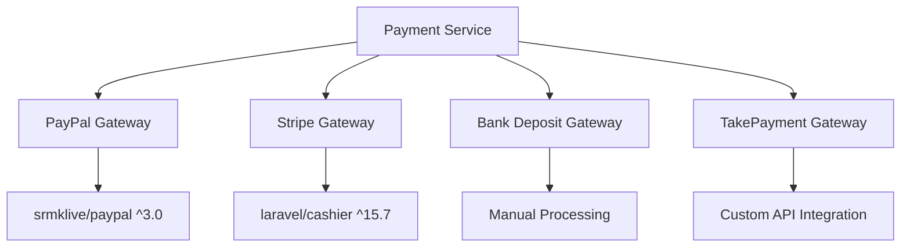
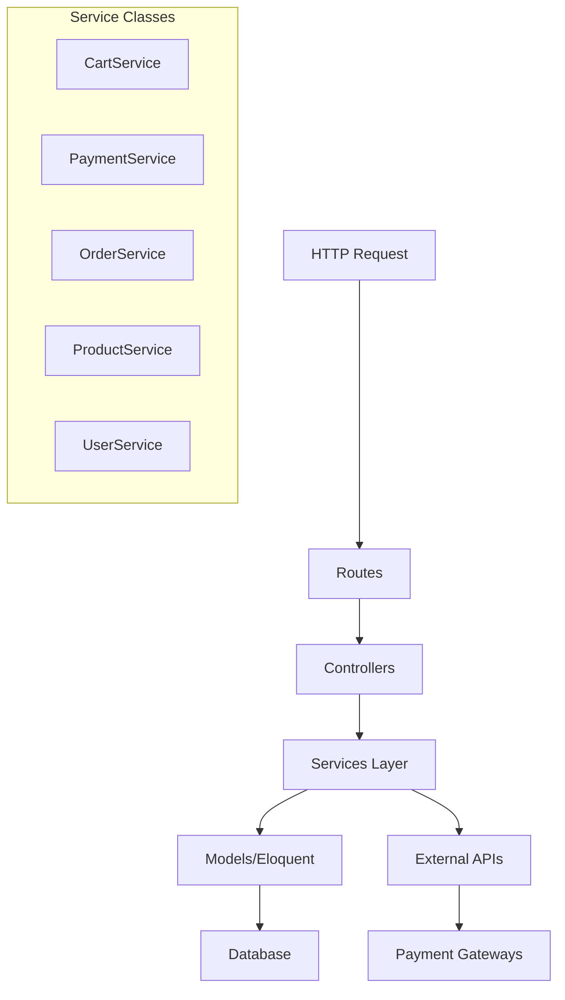
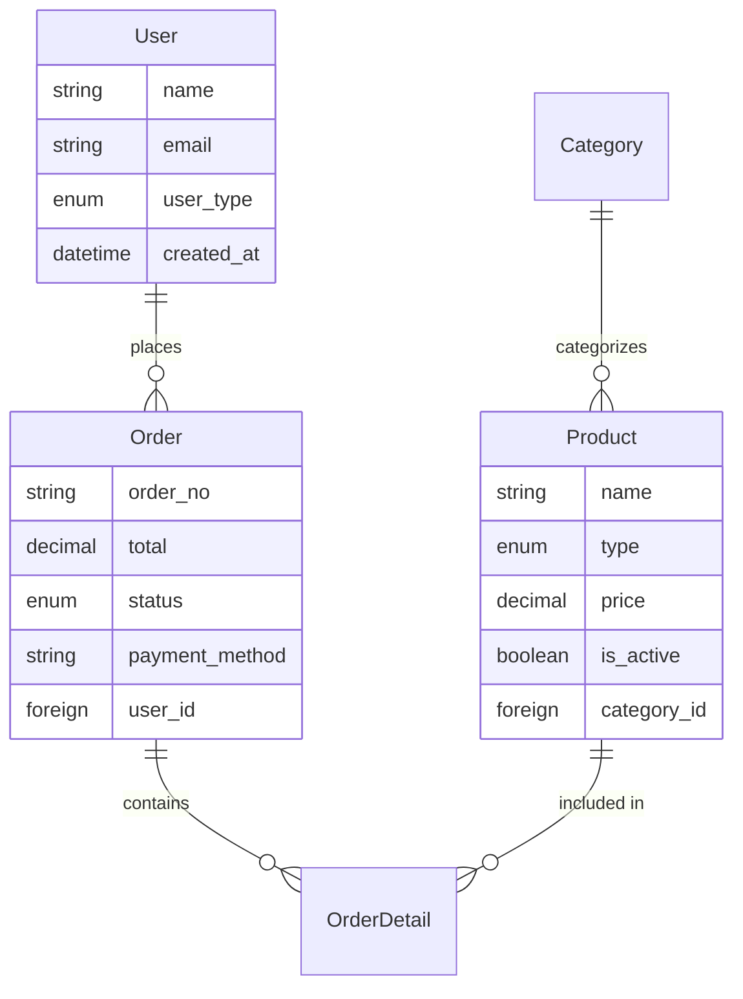
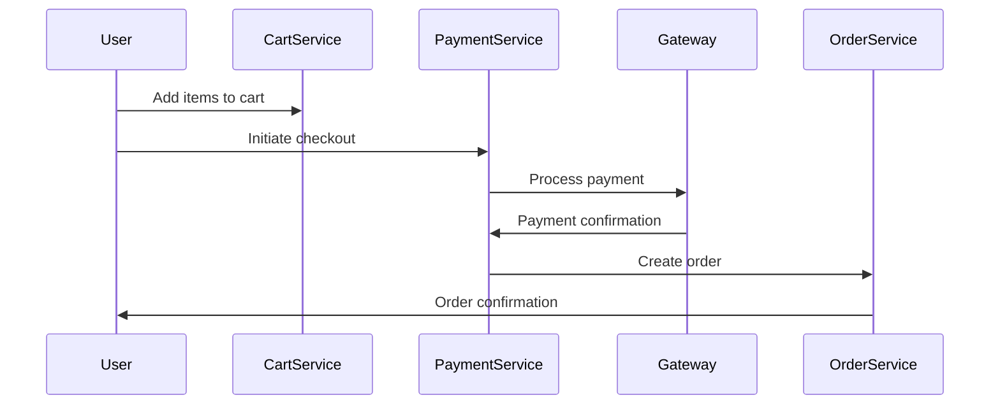
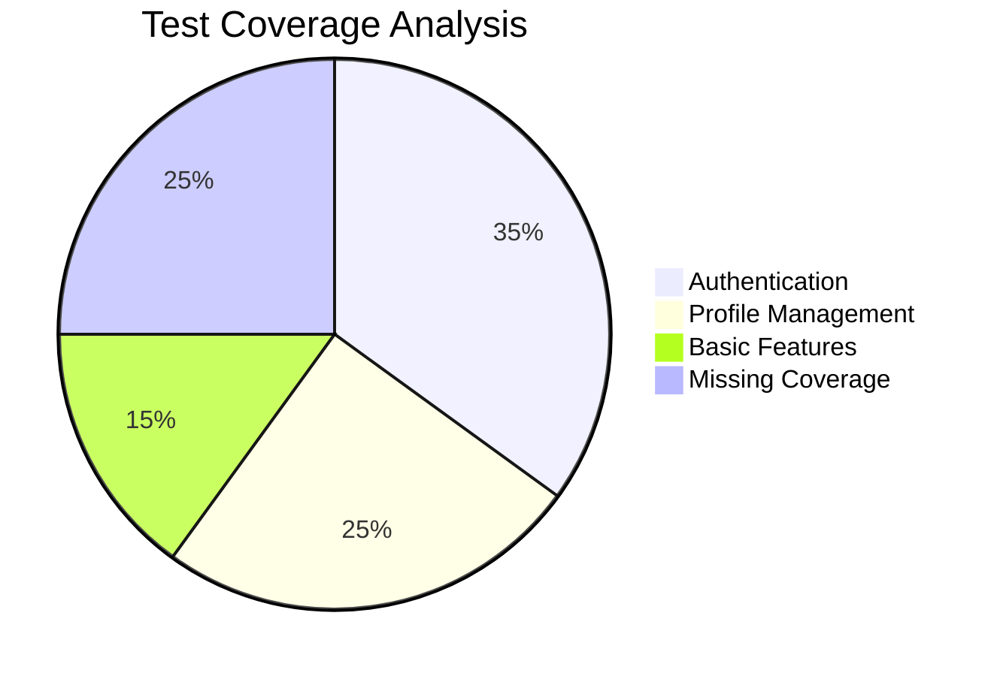
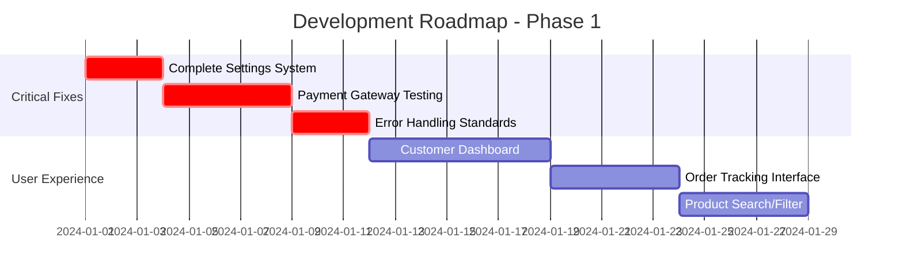
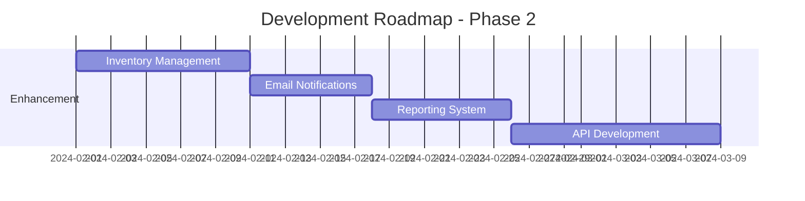

# Sejis Laravel E-Commerce Project Analysis

## Overview

**Project Type**: Laravel-based E-Commerce Platform  
**Framework**: Laravel 12  
**Primary Domain**: Kitchen Rental & Product Management System  
**Architecture**: MVC with Service Layer Pattern  
**Development Status**: Mid-stage development with core functionality implemented  

The Sejis project is a comprehensive e-commerce platform focused on kitchen rental services and product sales, featuring multi-payment gateway integration, role-based access control, and comprehensive order management capabilities.

## Technology Stack & Dependencies

### Backend Framework
- **Laravel 12** - Latest framework version with modern PHP 8.2+ features
- **PHP 8.2+** - Modern PHP with enhanced performance and type safety
- **Eloquent ORM** - Database abstraction and relationships

### Frontend & Assets
- **Vite 6.2.4** - Modern build tool for asset compilation
- **Tailwind CSS 3.1.0+** - Utility-first CSS framework
- **Alpine.js** - Lightweight JavaScript framework for interactivity
- **Blade Templates** - Server-side rendering

### Payment Integration


### Key Dependencies
- **spatie/laravel-medialibrary ^11.13** - Media management
- **anayarojo/shoppingcart ^4.2** - Shopping cart functionality
- **pestphp/pest ^3.8** - Modern testing framework

## Architecture

### Service Layer Architecture


### Component Hierarchy

#### Models & Relationships


#### Controller Organization
- **Admin Controllers**: Product, Order, Category, User management
- **Frontend Controllers**: Home, Cart, Checkout, Kitchen Rental
- **Auth Controllers**: Registration, Login, Password management

## Data Models & ORM Mapping

### Core Entities

#### User Model
```php
// Enums: UserTypeEnum (SUPER_ADMIN, ADMIN, CUSTOMER)
// Authentication: Laravel Breeze integration
// Role Management: AdminMiddleware for access control
```

#### Product Model
```php
// Features: Spatie Media Library integration
// Types: ProductTypeEnum with kitchen rental support
// Pricing: Supports both fixed and per-day pricing
// Categories: Hierarchical category relationships
```

#### Order Management
```php
// Status Flow: PENDING → PAID → COMPLETED (or CANCELED)
// Payment Integration: Multi-gateway support
// Details: Booking dates, durations, quantities
```

### Business Logic Layer

#### Payment Processing Flow


#### Order Lifecycle
- **Creation**: Cart items converted to order details
- **Payment**: Multi-gateway processing with callbacks
- **Fulfillment**: Status tracking and updates
- **Completion**: Final status and notifications

## Testing Strategy

### Current Test Coverage


#### Existing Tests (PestPHP)
- **Authentication Flow**: Login, registration, password reset
- **Profile Management**: Updates, email verification
- **Basic Integration**: Homepage rendering

#### Missing Test Areas
- **Payment Processing**: Gateway integrations untested
- **Cart Operations**: Add, update, remove functionality
- **Order Management**: Lifecycle and status changes
- **Admin Features**: Product/category management
- **Kitchen Rental**: Booking and scheduling logic

## Current Implementation Status

### ✅ Completed Features
- User authentication and role management
- Product and category CRUD operations
- Shopping cart functionality
- Multi-payment gateway integration
- Order creation and tracking
- Admin dashboard structure
- Opening hours and holiday scheduling
- Media file management

### ⚠️ Partially Implemented
- **Settings System**: Controller exists but empty implementation
- **Admin Features**: Some controllers lack full CRUD operations
- **Frontend UI**: Limited customer-facing pages
- **Payment Callbacks**: Some gateways need completion
- **Error Handling**: Inconsistent across controllers

### ❌ Missing Features
- **Inventory Management**: Stock tracking and alerts
- **Customer Dashboard**: Order history, profile management
- **Email Notifications**: Order confirmations, status updates
- **Reporting System**: Sales analytics and reporting
- **API Layer**: RESTful API for mobile/external integration
- **Advanced Search**: Product filtering and search functionality

## Critical Development Gaps

### 1. Incomplete Settings Management
```php
// Current: Empty controller methods
class SettingController extends Controller
{
    public function index() { // Empty implementation }
}

// Needed: Configuration management for:
// - Site settings, payment configurations
// - Email templates, notification preferences
// - Business rules and validation settings
```

### 2. Limited Frontend User Experience
- Missing customer dashboard
- No order tracking interface
- Limited product browsing capabilities
- Missing search and filtering

### 3. Testing Infrastructure Deficits
- No payment gateway testing
- Missing service layer tests
- No admin functionality testing
- Limited integration test coverage

## Next Development Actions

### Phase 1: Core System Completion (High Priority)


#### 1.1 Settings System Implementation
**Priority**: Critical  
**Effort**: 3-5 days  

```php
// Implement comprehensive settings management
// - Site configuration (name, logo, contact info)
// - Payment gateway configurations
// - Email templates and SMTP settings
// - Business rules (tax rates, shipping)
// - Notification preferences
```

#### 1.2 Payment System Hardening
**Priority**: Critical  
**Effort**: 5-7 days  

- Complete TakePayments gateway implementation
- Add comprehensive payment testing
- Implement webhook security validation
- Add payment failure recovery mechanisms
- Create payment audit logging

#### 1.3 Customer-Facing Features
**Priority**: High  
**Effort**: 7-10 days  

- Complete customer dashboard with order history
- Implement order tracking and status updates
- Add product search and filtering capabilities
- Create responsive product catalog interface

### Phase 2: System Enhancement (Medium Priority)


#### 2.1 Inventory Management System
- Stock level tracking and alerts
- Automatic inventory updates on orders
- Low stock notifications
- Supplier management integration

#### 2.2 Communication System
- Order confirmation emails
- Status update notifications
- Admin alert system
- Customer support integration

#### 2.3 Business Intelligence
- Sales reporting and analytics
- Customer behavior tracking
- Revenue analysis dashboards
- Export capabilities

### Phase 3: Advanced Features (Lower Priority)

#### 3.1 API Layer Development
- RESTful API for mobile applications
- Third-party integration capabilities
- API documentation and testing
- Rate limiting and security

#### 3.2 Performance Optimization
- Database query optimization
- Caching implementation (Redis/Memcached)
- CDN integration for media files
- Load testing and performance monitoring

#### 3.3 Security Enhancement
- Two-factor authentication
- Advanced role permissions
- Security audit logging
- GDPR compliance features

## Recommended Immediate Actions

### 1. Settings System Implementation (Start Immediately)
**Timeline**: 3 days  
**Impact**: Enables proper application configuration  

Create comprehensive settings management:
- Database schema for settings storage
- Admin interface for configuration updates
- Environment-based configuration validation
- Settings caching for performance

### 2. Payment Gateway Testing Suite (Week 1)
**Timeline**: 5 days  
**Impact**: Ensures payment reliability  

Develop comprehensive payment testing:
- Mock payment gateway responses
- End-to-end payment flow testing
- Error scenario handling
- Payment security validation

### 3. Customer Dashboard Development (Week 2)
**Timeline**: 7 days  
**Impact**: Improves user experience significantly  

Build complete customer interface:
- Order history and tracking
- Profile management
- Kitchen rental booking interface
- Download invoices and receipts

### 4. Test Coverage Expansion (Ongoing)
**Timeline**: Throughout development  
**Impact**: Reduces bugs and improves code quality  

Achieve 80%+ test coverage:
- Service layer unit tests
- Controller integration tests
- Payment gateway testing
- Admin functionality testing

The Sejis project demonstrates solid architectural foundations with modern Laravel practices. The immediate focus should be completing core functionality gaps, particularly the settings system and customer-facing features, followed by comprehensive testing implementation to ensure system reliability and maintainability.